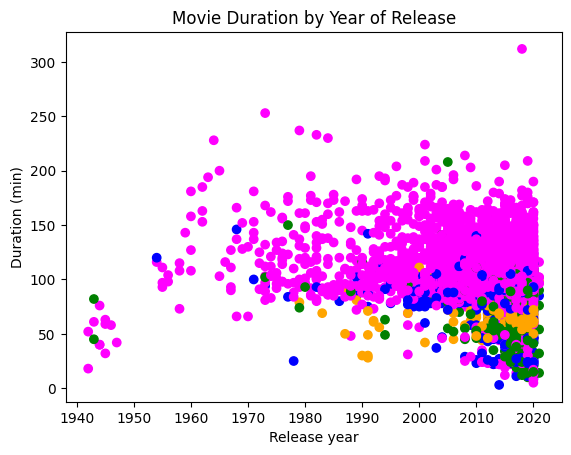

**Netflix**! What started in 1997 as a DVD rental service has since exploded into one of the largest entertainment and media companies.

Given the large number of movies and series available on the platform, it is a perfect opportunity to flex your data manipulation skills and dive into the entertainment industry. Our friend has also been brushing up on their Python skills and has taken a first crack at a CSV file containing Netflix data. They have been performing some analyses, and they believe that the average duration of movies has been declining. Using your friends initial research, you'll delve into the Netflix data to if you can explain some of the factors that may be contributing to the shortening movie lengths.

You have been supplied with the dataset `netflix_data.csv` , along with the following table detailing the column names and descriptions:

## The data
### **netflix_data.csv**
| Column | Description |
|--------|-------------|
| `show_id` | The ID of the show |
| `type` | Type of show |
| `title` | Title of the show |
| `director` | Director of the show |
| `cast` | Cast of the show |
| `country` | Country of origin |
| `date_added` | Date added to Netflix |
| `release_year` | Year of Netflix release |
| `duration` | Duration of the show |
| `description` | Description of the show |
| `genre` | Show genre |


```python
# Importing pandas and matplotlib
import pandas as pd
import matplotlib.pyplot as plt

#call read_data_from_csv to get dataframe
netflix_df=pd.read_csv('netflix_data.csv')

# Filter the data to remove TV shows
netflix_subset = netflix_df[netflix_df['type'] == 'Movie']

# Select specific columns and create a new DataFrame
netflix_movies = netflix_subset[['title', 'country', 'genre', 'release_year', 'duration']]

# Filter movies shorter than 60 minutes
short_movies = netflix_movies[netflix_movies['duration'] < 60]

# Initialize a list to store colors
colors = []

# Assign colors based on genre groups
for index, row in netflix_movies.iterrows():
    genre = row['genre']
    if genre == 'Children':
        colors.append('blue')
    elif genre == 'Documentaries':
        colors.append('green')
    elif genre == 'Stand-Up':
        colors.append('orange')
    else:
        colors.append('magenta')

        
# Create a scatter plot
fig, ax = plt.subplots()
ax.scatter(netflix_movies['release_year'], netflix_movies['duration'], c=colors)
ax.set_xlabel('Release year')
ax.set_ylabel('Duration (min)')
ax.set_title('Movie Duration by Year of Release')

# Show the plot
plt.show()

# After inspecting the plot, answer the question "Are we certain that movies are getting shorter?"
## After inspecting the scatter plot, we cannot be certain whether movies are getting shorter. 
## The plot provides a visualization of movie duration by year of release, showing the relationship between these two variables. 
## However, to determine if movies are getting shorter, we need to analyze additional information, such as statistical trends or 
## a more comprehensive examination of the dataset. Therefore, the answer should be "maybe."


answer="maybe"
```


    

    

